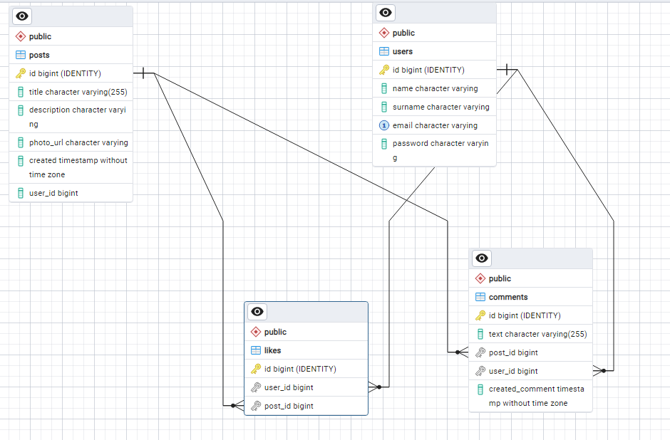

# Новостная интернет газета

## 1. Сборка проекта
1. Собрать .jar проекта mvn clean install
2. Запустить приложение в контейнере docker-compose up -d

## 2. Получение и работа с JWT токеном
- Время жизни токена - 60 минут
- Для получения сделать POST запрос в Postman "http://localhost:8080/registration"

     {
       "name": "Maxim",
       "surname": "Borodulin",
       "email": "Borodulin@mail.ru",
       "password": "12345"
     }

После окончания жизни токена сделать запрос в Postman "http://localhost:8080/registration"
    
    
      {
       "email": "Borodulin@mail.ru",
       "password": "12345"
     }
     

- Полученный JWT токен вставляем в header Authorization: Bearer JWT token

## 3. Диаграмма базы данных

## 4. Используемый стек технологий
1. Java 8
2. Spring Data JPA
3. Spring Security
4. Hibernate
5. JWT-api
6. PostgreSQL

## 5. Используемый стек технологий для тестирования
- Mockito

## 6. Используемые технологии для запуска
- Docker
